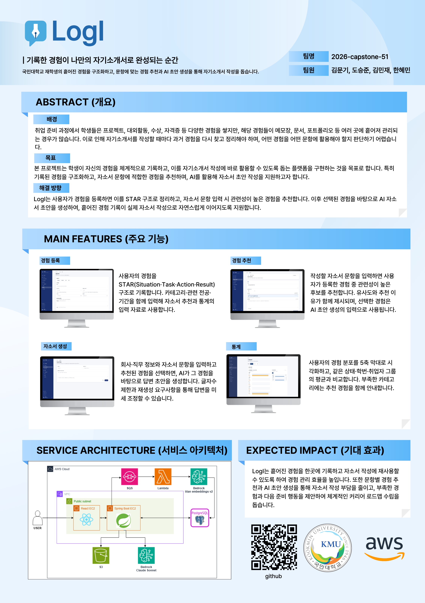

<div align="center">
  

  <h3>나의 경험이 자소서가 되다</h3>

  <p>AI 자기소개서 작성 보조 플랫폼 · 국민대학교 2026 캡스톤 디자인 51팀</p>

  <p>
    <a href="https://github.com/kookmin-sw/2026-capstone-51"></a>
    <a href="frontend/"></a>
    <a href="backend/"></a>
    <a href="#"></a>
  </p>
</div>

---

## 프로젝트 소개

**Logi**는 대학 4년간의 경험을 자소서 한 편으로 연결해 주는 자기소개서 작성 보조 플랫폼입니다.

평소에 자기 경험을 **STAR**(Situation · Task · Action · Result) 구조로 기록해두면, 자소서를 쓸 때 AI가 문항에 가장 잘 맞는 경험을 자동으로 추천하고 답변 초안까지 만들어 줍니다. 익명 비교 통계로 같은 학번·전공·희망직무를 가진 동료들과 내 준비도를 객관적으로 확인할 수도 있습니다.

> 경험은 많지만, 막상 자소서 앞에서 *"내가 그때 정확히 뭘 했더라?"* 막막했던 순간을 해결합니다.

---

## 포스터

<div align="center">
  <a href="docs/poster.pdf"></a>
  <p><em>클릭하면 <a href="docs/poster.pdf">PDF 원본</a> 으로 열립니다.</em></p>
</div>

---

## 우리가 해결하려는 문제

| | 문제 | Logi의 해결 |
|---|---|---|
| 01 | **경험은 많지만, 기억이 없다** — 4년 동안 쌓은 경험이 자소서 시점에 흐릿 | STAR 구조로 그때그때 저장 → 4년 뒤에도 꺼내 쓸 수 있는 경험 DB |
| 02 | **기록은 있지만, 활용이 어렵다** — 메모장·블로그·카톡에 흩어진 기록 | 벡터 검색으로 문항에 맞는 경험을 자동으로 매칭 |
| 03 | **소재를 찾아도 문장이 안 나온다** — 빈 페이지의 부담 | Claude AI가 내 경험을 기반으로 답변 초안을 생성 |
| 04 | **내 위치를 모른다** — 동료가 어디까지 준비했는지 알 수 없는 불안 | 익명 집계로 같은 학번·전공·직무 동료와 5축 비교 |

---

## 핵심 기능

### 1. 경험 자산화 (STAR)
인턴십, 프로젝트, 동아리, 대내외 활동, 자격증을 **STAR** 구조로 저장. 카테고리별 색·아이콘으로 한눈에 분류되고, 학기 타임라인 위에 마일스톤으로 누적됩니다.

### 2. 스마트 매칭 (Vector Search)
자소서 문항을 입력하면 **Amazon Titan Embed Text V2** 가 1536차원 벡터로 변환 → **PostgreSQL + pgvector** 유사도 검색으로 가장 잘 맞는 경험을 즉시 추천합니다.

### 3. AI 초안 작성 (Claude)
**Anthropic Claude Sonnet** 이 추천된 경험과 사용자 프로필을 바탕으로 자소서 답변 초안을 작성합니다. 마음에 안 들면 재생성, 일부만 고치고 싶으면 직접 편집.

### 4. 익명 비교 통계
같은 학번·전공·희망직무를 가진 동료들의 **익명 집계 데이터** 를 5축 레이더(인턴·대외활동·대내활동·아르바이트·자격증)로 보여줍니다. 막연한 불안 대신 명확한 방향을.

---

## 시스템 아키텍처

```
        ┌──────────────────┐                ┌────────────────────┐
        │   React 19 SPA   │   HTTPS /api   │  Spring Boot 3.5   │
        │   Vite · Tailwind├───────────────►│  Java 21 · Security│
        │   (HashRouter)   │   JWT          │  (REST API)        │
        └──────────────────┘                └────────┬───────────┘
                                                     │
                              ┌──────────────────────┼────────────────────────┐
                              │                      │                        │
                              ▼                      ▼                        ▼
                    ┌──────────────────┐   ┌──────────────────┐   ┌──────────────────┐
                    │ PostgreSQL       │   │  AWS SQS         │   │  AWS S3          │
                    │  + pgvector      │◄──┤  (비동기 임베딩) │   │  (자격증 PDF)    │
                    └──────────────────┘   └────────┬─────────┘   └──────────────────┘
                              ▲                      │
                              │                      ▼
                    ┌─────────┴────────┐   ┌──────────────────┐
                    │ Claude Sonnet    │   │  Amazon Titan    │
                    │ (자소서 생성)    │   │  Embed Text V2   │
                    │ via Bedrock      │   │  (1536-dim)      │
                    └──────────────────┘   └──────────────────┘
```

---

## 기술 스택

### Frontend (`frontend/`)
| | |
|---|---|
| 프레임워크 | React 19 · Vite 8 · JSX only (no TypeScript) |
| 스타일 | Tailwind CSS · 커스텀 디자인 토큰 (`@layer components`) |
| 상태/데이터 | Zustand (인증·토스트) · TanStack Query (서버 상태) |
| 라우팅 | React Router v6 (HashRouter) |
| 시각화 | Three.js (5축 입체 레이더) · SVG |
| 품질 | ESLint (flat config) · Prettier · Husky · lint-staged |

### Backend (`backend/`)
| | |
|---|---|
| 런타임 | Java 21 · Spring Boot 3.5.6 · Gradle |
| 데이터 | PostgreSQL + pgvector · Spring Data JPA |
| 비동기 | AWS SQS (임베딩 워커) |
| 보안 | Spring Security · JWT (access + refresh) · Google OAuth 2.0 |
| AI | Spring AI · Anthropic Claude Sonnet · Amazon Titan Embed Text V2 |
| 스토리지 | AWS S3 (자격증 PDF presigned URL) · AWS EC2 |
| 문서 | SpringDoc OpenAPI (Swagger UI) |

### 인증
- **Google OAuth 2.0** (`@kookmin.ac.kr` 도메인 한정 — 재학생/졸업생 인증)
- JWT access token + refresh token, 자동 reissue 큐
- `ApiResponse<T> = { statusCode, message, data }` 표준 응답 포맷

---

## 실행 방법

### Frontend
```bash
cd frontend
npm install
cp .env.local.example .env.local        # VITE_API_URL, OAuth client_id 등
npm run dev                              # http://localhost:3000
```
- 포트 3000 강제 (`vite.config.js` `strictPort: true`) — OAuth `redirect_uri` 일치 목적
- 기본 API: `https://api.logi.p-e.kr/api` (배포 백엔드)

### Backend
```bash
cd backend
./gradlew bootRun                        # http://localhost:8080/api
```
- 환경 변수: DB / AWS / Bedrock / Google OAuth 자격증명 필요
- Swagger UI: `http://localhost:8080/api/swagger-ui/index.html`

> 상세 가이드는 [frontend/CLAUDE.md](frontend/CLAUDE.md) / [backend/CLAUDE.md](backend/CLAUDE.md) 참고.

---

## 팀 소개

| 이름 | 역할 | GitHub |
|------|------|--------|
| 김문기 | Backend · Team Lead | [@Kimmoongi0320](https://github.com/Kimmoongi0320) |
| 김민재 | Backend | [@Dlawoct](https://github.com/Dlawoct) |
| 도승준 | Frontend | [@SudoSzune](https://github.com/SudoSzune) |
| 한혜민 | Frontend | [@gksgpals](https://github.com/gksgpals) |

---

## 링크

- **팀 페이지**: https://kookmin-sw.github.io/2026-capstone-51/
- **레포지토리**: https://github.com/kookmin-sw/2026-capstone-51
- **API 문서 (Swagger)**: https://api.logi.p-e.kr/api/swagger-ui/index.html

---

## 라이센스

본 프로젝트는 국민대학교 2026학년도 캡스톤 디자인 수업 과제로 진행되고 있습니다. 학습·교육 목적 외의 사용은 팀에 문의 바랍니다.
